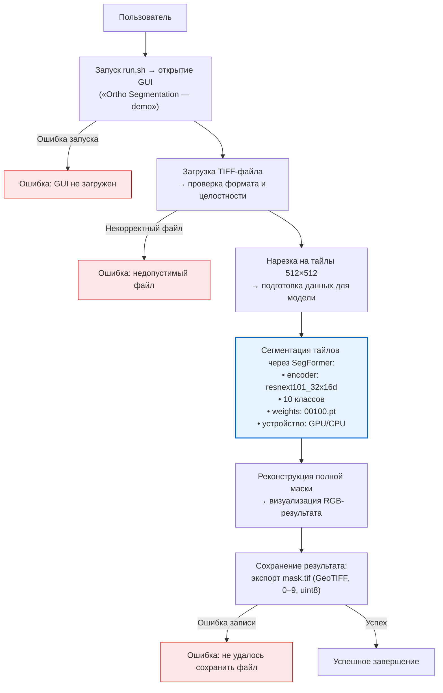
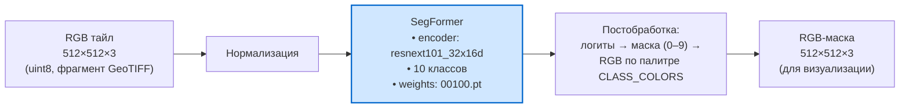

# Ссылка на google диск
https://drive.google.com/drive/folders/1QgPXCPgAIAqRKDVx_U73O_hpCteFUXcr?usp=drive_link

В Google Диске находятся видео работы программы по обработке ортофотопланов и видео работы программы по обработке видеопотока с дрона.

# Структура github
В папке Документы находятся следующие файлы:   
    Метрики.docx — теоретическое описание метрик для оценки качества нейросетей.  
    Отчёт по обучению нейронной сети.pdf — подробный отчёт об обучении нейронной сети.  
    /методики испытаний — папка с документом, описывающим методики испытаний программного обеспечения, а также фотографиями работы программы.

В папке src находится исходный код:   
    /drone — код программы обработки видео с дрона.  
    /land_segmentation — код программы сегментации ортофотопланов.  
    /train — код, используемый для обучения нейронной сети.

Список зависимостей для программы по обработке ортофотопланов находится в файле src/land_segmentation/requirements.txt.

# AI_HI_TECH_TSU

# ТЕХНОЛОГИИ ИИ В КОМПЛЕКСНЫХ БЕСПИЛОТНЫХ СИСТЕМАХ 
# Автоматическая классификация сельскохозяйственных земель на ортофотопланах

# Задача №2

Разработать алгоритм автоматической сегментации/классификации сельскохозяйственных угодий по ортофотопланам GeoTIFF, полученным с БАС (GSD ~10 см/пикс). Необходимо выделять классы (например: пашня, дорога, лесополоса/защитная полоса, водный объект и др.), обеспечить корректную работу с тайлами без потери геопривязки (GDAL). Результат: обученная модель с весами и, по возможности, простой интерфейс; партнер предоставляет размеченные данные объёмом ~1000 Мп.

Develop an automatic segmentation/classification algorithm for agricultural land using GeoTIFF orthomosaics captured by UAS (GSD ~10 cm/pixel). The solution should delineate classes (e.g., cropland, road, shelterbelt/forest belt, water body, etc.) and handle tiling without losing georeferencing (e.g., via GDAL). Deliverables: a trained model with weights and, if possible, a simple UI; the partner provides labeled data totaling ~1,000 megapixels.

# Команда Национального исследовательского Томского государственного университета

- Бондарчук А.С
    - mail: bondarchuk.a.c@gmail.com
    - роль: системный инженер
- Колоев М.И.
    - mail: maxkolo57@gmail.com
    - роль: ML-инженер
- Крючков Д.Д.
    - mail: ddubstepov@gmail.com
    - роль: инженер по данным
- Чернов С.А.
    - mail: sergej.chernov2003@gmail.com
    - роль: инженер-конструктор БАС 

# Инструкция по запуску программы «Ortho Segmentation — demo»

Программа работает на операционной системе Ubuntu 20.04 и выше.
На системе должен быть установлен Python 3.10 или новее, а также модуль виртуализации venv. 

Перед запуском программы необходимо установить все зависимости. Для этого выполните команду:   
bash install.sh

После успешной установки зависимостей запустите программу с помощью команды:  
bash run.sh

Веса модели находятся на Google Диске по ссылке https://drive.google.com/drive/folders/1QgPXCPgAIAqRKDVx_U73O_hpCteFUXcr?usp=drive_link
Модель называется 00100.pt. Для работы программы её необходимо поместить в папку:  
scr/land_segmentation/models

## 1. Архитектура программы по обработке ортофотоплана

### Блок схема работы программы

### Блок схема обработки данных моделью ИИ 

### 1.1. Структура файлов и директорий

project_root/ 

├── core/

│   ├── processing.py        # Нарезка тайлов, реконструкция маски, экспорт GeoTIFF

│   └── segmentation.py      # Логика сегментации: простая (цветовая) → модель (SegFormer)

├── models/

│   └── 00100.pt             # Предобученная модель SegFormer (10 классов)

├── ui_mainwindow.py         # PyQt5 UI: загрузка, сегментация, превью, экспорт

└── main.py                  # Запуск GUI (подразумевается)

### 1.2. Временная рабочая директория (создаётся при запуске)

/tmp/ortho_seg_xxxxxx/        # tempfile.mkdtemp()

├── images/                   # PNG-тайлы 512×512 (с zero-padding)

├── masks/                    # mask_XXXX_XXXX.npy — результаты сегментации (RGB или uint8)

└── meta/                     # tile_XXXX_XXXX.json — метаданные (координаты, transform, CRS)

## 2. Основные модули и их функции

### 2.1. `core/processing.py` — геообработка

- **`tile_raster_to_pngs(...)`**  
  Разбивает GeoTIFF на квадратные тайлы (512×512 с zero-padding), сохраняет:
  - `images/tile_*.png`
  - `meta/tile_*.json` с `x_off`, `y_off`, `original_width/height`, `transform`, `crs`.

- **`reconstruct_mask_from_tiles(...)`**  
  Собирает `mask_*.npy` в полную маску, **исключая padded области** по `original_width/height` из мета.

- **`save_mask_as_geotiff(...)`**  
  Сохраняет маску (`reconstructed_mask.npy`) как гео-привязанный GeoTIFF:
  - Поддерживает и **монохромные (1-канальные)**, и **RGB-маски (3-канальные)**.
  - Использует `transform` и `crs` из первого meta-файла.

### 2.2. `core/segmentation.py` — сегментация

- **Классы и цвета**  
  - `CLASS_MAP`: 10 семантических классов (фон, вода, дороги, леса и т.д.)
  - `CLASS_COLORS`: RGB-палитра для визуализации.

- **Методы сегментации**  
  - `multi_class_tile_segmentation(...)`: упрощённая цветовая сегментация (для тестов).
  - `multi_class_tile_segmentation_rgb(...)`: то же, но с выводом в RGB.
  - `model_segmentation(...)`: **основной метод** — использует **SegFormer** (на базе ResNeXt101) для предсказания классов → конвертирует в RGB по палитре.

- **`SegmentationWorker(QThread)`**  
  - Запускает обработку в фоне (чтобы не блокировать UI).
  - Этапы:
    1. Очистка временной директории.
    2. Нарезка тайлов.
    3. Сегментация каждого тайла через нейросеть.
    4. Реконструкция полной маски.
    5. Экспорт как GeoTIFF.
  - Поддерживает GPU (`cuda`), fallback на CPU.
  - Загружает модель из `../models/00100.pt`.

- **`mask_to_rgb_preview(...)`**  
  Конвертация числовой маски (0–9) в RGB-изображение для отображения в UI.

### 2.3. `ui_mainwindow.py` — PyQt5 интерфейс

- **Основные компоненты**:
  - Кнопки: загрузка GeoTIFF → сегментация → сохранение результата.
  - Превью: отображение исходного изображения и сегментированной маски.
  - Прогресс-бар и лог.
  - **Легенда классов** (цвет + название).

- **Жизненный цикл**:
  - При старте — создаёт `tempfile.mkdtemp()`.
  - При закрытии — удаляет временную директорию.
  - Результаты сохраняются только по кнопке *«Сохранить»* → копируется `mask.tif`.

## 3. Технологический стек

| Компонент | Инструмент |
|--------|-----------|
| **Геоданные** | `rasterio`, `Affine` |
| **Обработка изображений** | `PIL`, `numpy` |
| **Глубокое обучение** | `PyTorch`, `segmentation_models_pytorch` (SegFormer) |
| **Интерфейс** | `PyQt5` |
| **Асинхронность** | `QThread` |
| **Форматы** | GeoTIFF → PNG/NPY → GeoTIFF |

## 4. Особенности архитектуры

- **Модульность**: обработка, сегментация и UI разделены.
- **Геопривязка сохраняется**: метаинформация используется при нарезке и сборке.
- **Поддержка RGB-вывода**: маска хранится как `(H, W, 3)` массив для удобства визуализации.
- **Zero-padding вместо отбрасывания краёв**: все тайлы строго 512×512 → проще работать с CNN.
- **Временные файлы**: безопасная изоляция процесса сегментации.

## 5. Возможные улучшения (опционально)

- Поддержка `.jpg` и других форматов входа.
- Настраиваемый `tile_size` через UI.
- Опция выбора модели (из нескольких в `models/`).
- Валидация входного изображения (3 канала? 8-бит?).
